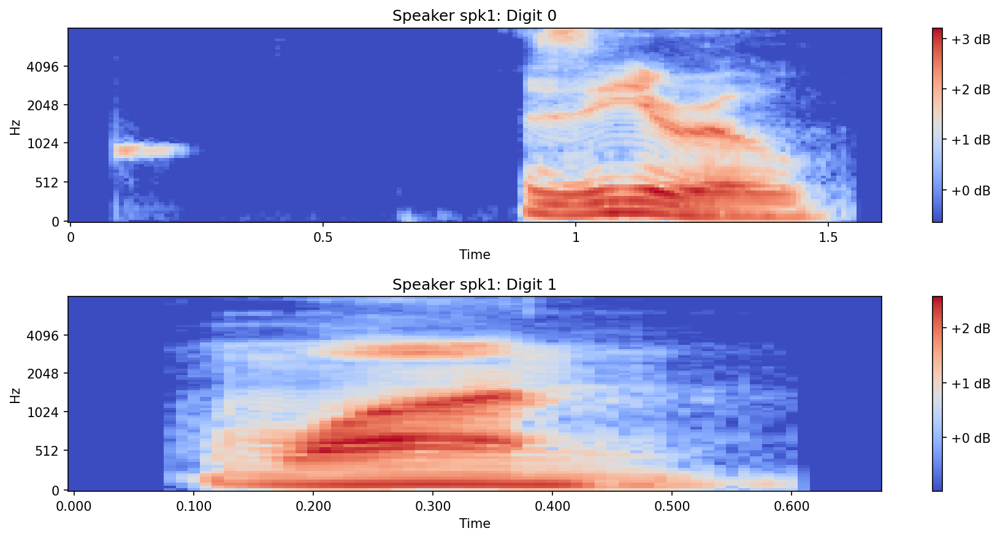
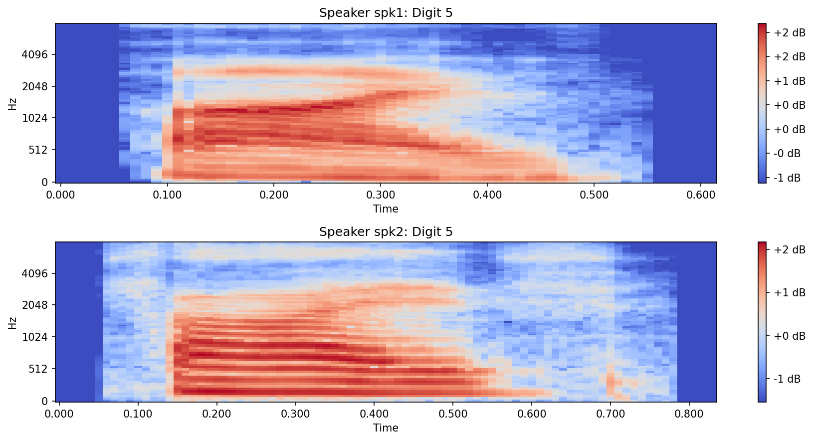
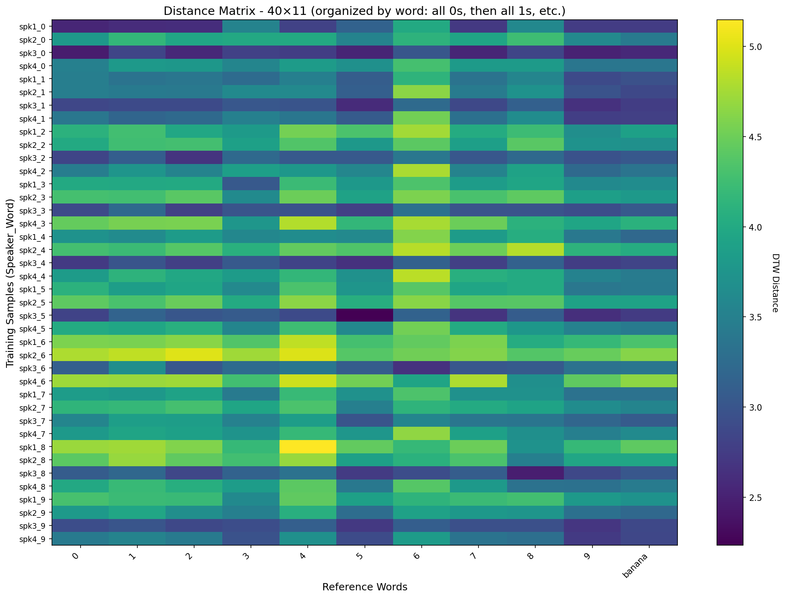
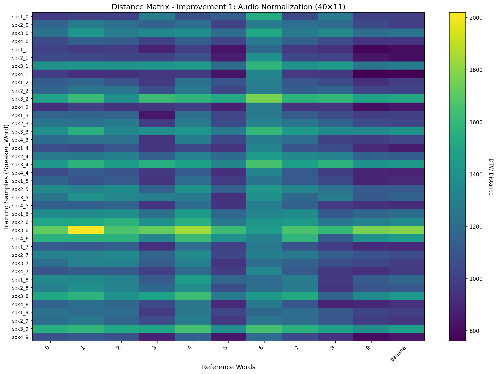
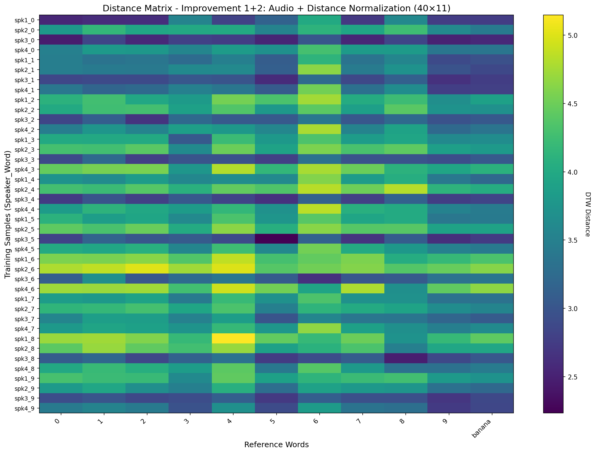
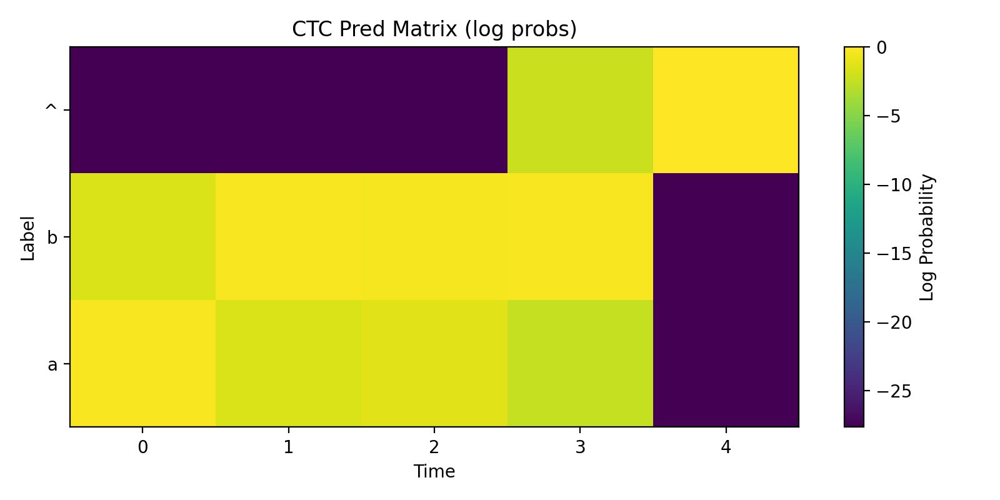
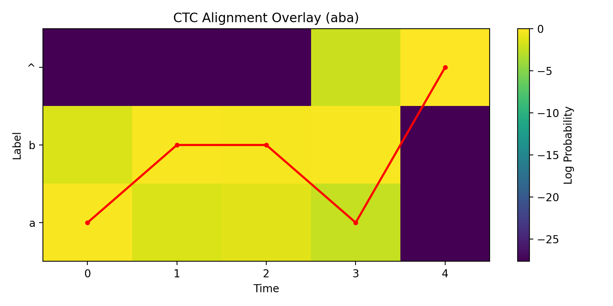
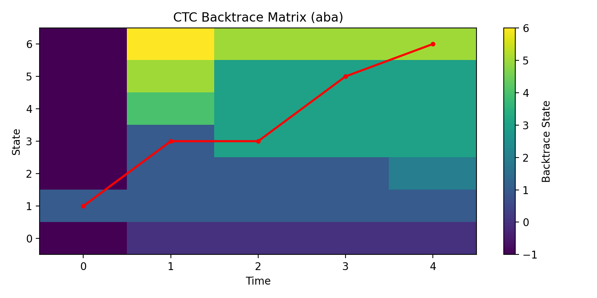
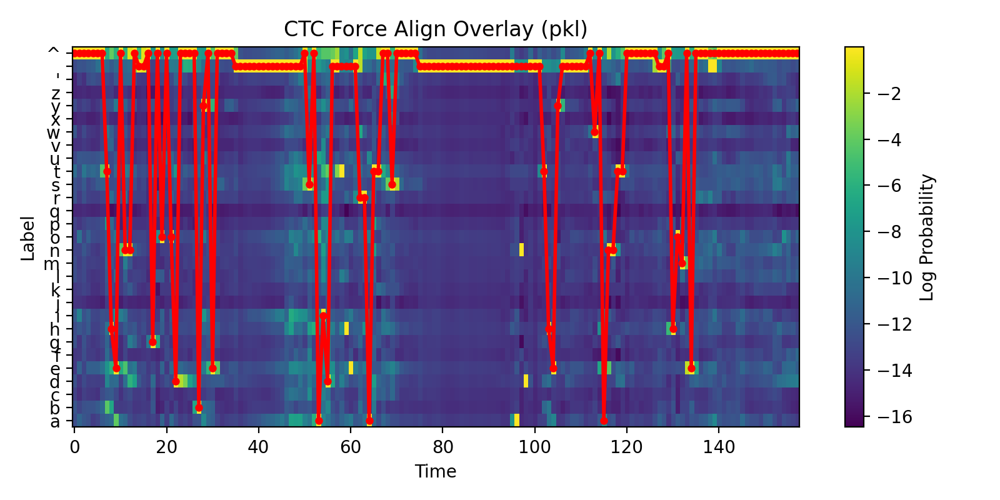
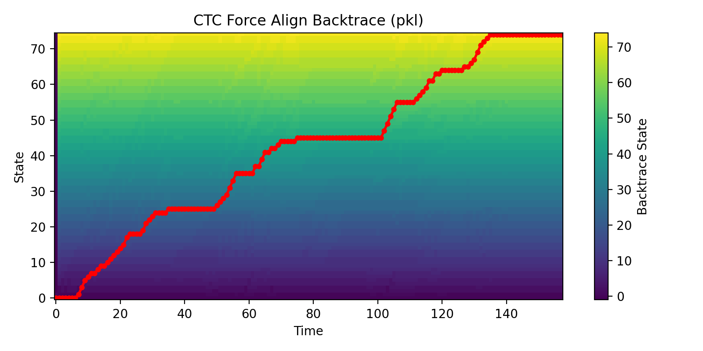

# Assignment 2: Automatic Speech Recognition (ASR) basics

**Course:** Advanced Topics in Audio Processing using Deep Learning 

Gal Getz (208605154), Shir Rashkovitz (209144013), Shoham Mazuz (322299496), Omer Ventura (207043860)

**Environment:** Python 3.10

## Project Overview

This project implements a basic ASR pipeline, including data loading, feature extraction using Mel Spectrograms, and sequence alignment/classification using **Dynamic Time Warping (DTW)** and **Connectionist Temporal Classification (CTC)**.


## 1. Dataset & Preprocessing

**Data Collection:** Recorded 9 individuals (4 females, 5 males) pronouncing digits 0-9 and a random word ("banana"). Overall collected 11 audio files per speaker (Total: 99 files).

**Resampling:** All audio files are resampled to a consistent frequency of 16 kHz.

**Data Split:** 
- **Class Representative:** 1 speaker (used as the reference to align with)
- **Training Set:** 2 males, 2 females.
- **Evaluation Set:** 2 males, 2 females.


## 2. Feature Extraction

For each audio file, we compute a Mel Spectrogram with the following parameters:
**Window size:** 25ms, **Hop size:** 10ms, **Filter banks (N_mels):** 80.

### 2.d. Mel Spectrogram Analysis

After computing the Mel Spectrograms, we present several samples and analyze the differences:

#### i. Differences within Speaker Samples (Different Digits)

We compare different digits spoken by the same speaker to observe how different phonemes are represented in the mel-scale frequency domain.



**Analysis:**
- **Temporal Characteristics:** Different digits have distinct temporal patterns. For example, digit "0" (zero) typically has a longer duration and different formant transitions compared to digit "1" (one).
- **Frequency Patterns:** Each digit exhibits unique formant structures:
  - Digit "0" shows formant transitions characteristic of the "z" and "o" sounds
  - Digit "1" displays the spectral signature of the "w" and "n" sounds
- **Energy Distribution:** The mel spectrogram captures the perceptual differences between phonemes, with energy concentrated in different frequency bands for each digit

#### ii. Differences across Digit Samples (Different Speakers/Genders)

We compare the same digit spoken by different speakers to observe how individual speaker characteristics and gender differences affect the spectral representation. The comparison shown is between Speaker 1 (Male) and Speaker 2 (Female) pronouncing the digit "5".



**Analysis:**
- **Formant Frequency Variations:** Different speakers show variations in formant frequencies due to differences in vocal tract length and shape. Male speakers typically have lower formant frequencies than female speakers due to longer vocal tracts.
- **Fundamental Frequency :** Gender differences are particularly visible in the fundamental frequency (pitch), with female voices generally having higher values, visible in the lower mel frequency bins.
- **Spectral Envelope:** While individual characteristics vary, the overall spectral envelope shape that defines the digit identity is preserved across speakers. The formant structure that makes "5" recognizable as "five" is maintained.
- **Speaking Rate and Articulation:** Different speakers may have varying speaking rates and articulation styles, leading to differences in temporal duration and formant transitions, but the core phonetic content remains identifiable.

## 3. Dynamic Time Warping (DTW)
**Goal:** Align training/evaluation samples against the Class Representative's reference signals.
**Classification:** Each recording is classified based on the minimum DTW cost.
**Thresholding:** A similarity threshold is implemented to ensure the random word ("banana") is correctly labeled as a non-digit.
**Optimization:** Applied normalization (AGC) and length-based distance normalization.

### 3.a. Class Representative as Reference Database

The class representative recordings (1 speaker with 11 files: digits 0-9 + "banana") are selected as the reference database (DB). Each reference signal is a Mel Spectrogram that serves as a template for comparison.

**Implementation**: `preprocessing.py` → `load_and_split_dataset()` loads files with prefix `rep_` into `dataset['representative']`, containing 11 spectrograms (one per word).

### 3.b. DTW Algorithm Implementation

The DTW algorithm is implemented in `dtw_classification.py` → `compute_dtw_distance()`.

**Implementation Details:**
- Computes the optimal alignment between two Mel Spectrogram sequences
- Uses dynamic programming with a cost matrix
- Applies the recursive formula: `D(i,j) = d(i,j) + min(D[i-1,j], D[i,j-1], D[i-1,j-1])`
- Normalizes the final cost by path length `(N + M)` to account for different audio durations (Section 3.g.ii)

### 3.c. Compare Training Set with Reference DB

Each audio file in the training set is compared against all 11 reference signals using DTW. This algorithm aligns two sequences of feature vectors (Mel Spectrograms) by finding the optimal alignment that minimizes the total cost between them.

**Implementation**: `dtw_classification.py` → `build_distance_matrix()` iterates through all training speakers and files, computing DTW distance to each reference signal.

**Result**: For each training sample, we obtain 11 DTW distance values (one for each reference word), representing how similar the sample is to each reference template. Lower distances indicate better matches.

### 3.d. Distance Matrix

A distance matrix is constructed with dimensions **4 × 10 × 11** (4 speakers × 10 digits × 11 reference signals). Each cell represents the DTW cost between a recording in the training set and a recording in the DB.

The matrix can be presented as **40 × 11** (40 = 4 speakers × 10 digits, excluding banana from rows) or **44 × 11** (including banana rows).

**Organization**: The distance matrices are organized by word for better visualization. All recordings of the same word are grouped together (e.g., all speakers saying "0" in rows 0-3, all speakers saying "1" in rows 4-7, etc.). This organization makes it easier to observe patterns and compare how different speakers' pronunciations of the same digit match against the reference signals.



**Analysis**: The distance matrix shows that samples generally have lower distances to their corresponding reference words. For example, training samples of digit "0" (rows 0-3) typically show the lowest distance in the "0" column of the matrix. Darker colors (lower values) indicate better matches, while lighter colors (higher values) indicate poorer matches.

### 3.e. Set Threshold and Determine Classification

A threshold is set on the distances to determine the classification of each audio signal. The algorithm should not label the random word ("banana") as a digit (it should be below the similarity threshold).

**Threshold Method**: Mean + 2×std of correct match distances from the training set.

**Important**: The threshold is calculated **only from training data** and then applied to both training and evaluation sets. This ensures no data leakage - the evaluation set is never used to determine the threshold.

**Implementation**: 
- `utils.py` → `find_optimal_threshold()`: Determines threshold based on mean + 2×std of correct match distances from **training set only**
- `utils.py` → `classify_recordings()`: Classifies each recording based on the closest match in the DB (minimum DTW distance)
- If the minimum distance exceeds the threshold, the sample is classified as "banana / non digit"
- The same threshold is applied to both training and evaluation sets

**Classification Process**:
1. For each training sample, find the reference word with minimum DTW distance
2. If minimum distance > threshold → classify as "banana / non digit"
3. Otherwise → classify as the reference word with minimum distance

**Training Set Results (Baseline - before improvements)**:
- **Optimal threshold**: 1475.33 (calculated from training set, raw DTW distances)
- **Classification accuracy**: 36.36% (16/44 correct)
- **Correct predictions**: 16 out of 44 samples
- **Misclassifications**: 28 samples

_train.png)

**Interesting Observations**:
- Most common misclassifications: "4" → "banana" (3 times), "6" → "8" (3 times), "1" → "9" (2 times)
- 10 out of 40 digit samples were misclassified as "banana" (threshold may be too strict for some digits)
- Per-digit accuracy varies significantly: "3" and "8" perform best (75%), while "1", "4", and "7" have 0% accuracy

### 3.f. Apply Threshold on Validation Set

The selected threshold (determined from training set) is applied to the distance matrix of the **evaluation (validation) set**. This tests the generalization ability of the classifier on unseen data.

**Note**: This section shows **baseline results** (before improvements). Section 3.g shows how improvements increase the accuracy.

.png)

**Evaluation Set Results (Baseline - before improvements)**:
- **Threshold applied**: 1475.33 (same as training set, raw DTW distances)
- **Classification accuracy**: 22.73% (10/44 correct)
- **Correct predictions**: 10 out of 44 samples
- **Misclassifications**: 34 samples

_eval.png)

**Analysis**: 
- The confusion matrix shows correct classifications on the diagonal and misclassifications as off-diagonal entries
- The evaluation set accuracy (22.73%) is lower than training set accuracy (36.36%)
- The threshold is in raw DTW distance scale (1475.33), which makes it difficult to interpret
- Without distance normalization, longer audio files have systematically higher distances, biasing the classifier

### 3.g. Improvements

Improvements are applied **cumulatively** (each improvement builds on the previous ones). We analyze the accuracy and generate distance/confusion matrices after each improvement to measure their impact.

#### 3.g.i. Normalizing the Audio (using AGC)

Audio normalization is applied during feature extraction to ensure consistent amplitude levels across recordings.

**Implementation**: `preprocessing.py` → `extract_features()`:
- Audio is normalized by maximum amplitude: `audio_signal / max(|audio_signal|)`
- This ensures all audio files have similar amplitude ranges before computing Mel Spectrograms
- Helps reduce the impact of recording volume differences on DTW distances

**Results after Improvement 1 (Audio Normalization only)**:
- **Training accuracy**: 36.36% (16/44 correct) - **same as baseline**
- **Evaluation accuracy**: 22.73% (10/44 correct) - **same as baseline**
- **Threshold**: 1475.33 (same as baseline - audio normalization doesn't change DTW distances)




**Analysis**: Audio normalization alone does not improve accuracy (same as baseline). The threshold remains 1475.33 and results are identical because:

1. **Audio normalization** normalizes the raw audio: `audio / max(|audio|)`
2. **Mel spectrogram computation** converts to frequency domain
3. **Log conversion** normalizes: `librosa.power_to_db(mel_spec, ref=np.max)` - normalizes by the max of the mel spectrogram
4. **Final normalization** standardizes: `(log_mel - mean) / std` - makes mean=0, std=1

The double normalization in steps 3 and 4 makes the final features **independent of the original audio amplitude**. Therefore, audio normalization (step 1) becomes redundant - the spectrograms end up being identical (within numerical precision: max difference ~0.000008), so DTW distances are identical, and thresholds are identical.

**Verification**: The distance matrices differ by only 0.00045 (numerical precision), confirming that audio normalization has no effect when spectrograms are normalized afterward. The confusion matrix shown above is identical to the baseline confusion matrix (section 3.f) since the results are the same. This demonstrates that volume differences are not the main source of classification errors, and the normalization doesn't address the core challenge of comparing sequences of different lengths.

#### 3.g.ii. Normalizing the Distance w.r.t. the Length of Each Audio File

Distance normalization accounts for different audio durations by dividing the DTW cost by the total path length.

**Implementation**: `dtw_classification.py` → `compute_dtw_distance()` with `normalize=True`:
- Final cost divided by `(N + M)` where N and M are the number of frames in each sequence
- Prevents longer audio files from having systematically higher distances
- Makes distances comparable across different speaking rates

**Results after Improvement 1+2 (Audio + Distance Normalization)**:
- **Training accuracy**: 38.64% (17/44 correct) - **+2.28% improvement over baseline (36.36%)**
- **Evaluation accuracy**: 27.27% (12/44 correct) - **+4.55% improvement over baseline (22.73%)**
- **Threshold**: 4.61 (normalized scale, calculated from training set, applied to both sets)
- **Note**: These are the **final results** after all improvements. Compare with baseline results in sections 3.e (36.36% training) and 3.f (22.73% evaluation).




**Improvement Analysis**:
- **Baseline (no improvements)**: 22.73% evaluation accuracy
- **After Improvement 1 (Audio norm)**: 22.73% evaluation accuracy (no change)
- **After Improvement 1+2 (Audio + Distance norm)**: 27.27% evaluation accuracy (**+4.55% improvement**)

**Key Findings**:
1. **Audio normalization contribution**: +0.00% (no improvement when applied alone)
2. **Distance normalization contribution**: +4.55% (significant improvement)
3. **Total improvement**: +4.55% over baseline

**Why distance normalization is crucial**:
- Without normalization, longer audio files have systematically higher DTW distances
- This biases the classifier toward shorter recordings
- Distance normalization makes distances comparable across different speaking rates and durations
- The threshold becomes more meaningful when distances are on a normalized scale (4.61 vs 1475.33)


**Summary of All Improvements**:

| Configuration | Training Accuracy | Evaluation Accuracy | Improvement |
|--------------|-------------------|---------------------|-------------|
| Improvement 1: Audio Normalization | 36.36% | 22.73% | +0.00% (no change from baseline) |
| Improvement 1+2: Audio + Distance Normalization | 38.64% | 27.27% | **+4.55%** (over baseline) |

The distance normalization (Improvement 2) provides the most significant improvement, increasing evaluation accuracy by 4.55 percentage points over the baseline.

### Results and Predictions Summary

**Training Set Results:**
- **Optimal threshold**: 4.6115 (mean + 2×std of correct match distances from training set)
- **Classification accuracy**: 38.64% (17/44 correct)
- **Method**: Each sample is classified based on minimum DTW distance; samples with distances above threshold are labeled as "banana / non digit"

**Evaluation Set Results:**
- **Threshold applied**: 4.6115 (same threshold from training set)
- **Classification accuracy**: 27.27% (12/44 correct)
- **Generalization**: Lower accuracy on evaluation set suggests the threshold may not generalize perfectly to unseen speakers/recordings

**Key Observations**:
1. **Digit Confusion Patterns**: 
   - Most confused pairs: "2"→"9" (5 times), "6"→"8" (5 times), "1"→"9" (4 times)
   - These confusions likely occur due to similar spectral characteristics or pronunciation variations

2. **Banana Classification**:
   - Training: 0/4 banana samples misclassified as digits (100% correct)
   - Evaluation: 1/4 banana samples misclassified as digits (75% correct)
   - The threshold effectively distinguishes "banana" from digits in most cases

3. **Digit-to-Banana Misclassifications**:
   - Training: 10/40 digit samples misclassified as "banana"
   - Evaluation: 9/40 digit samples misclassified as "banana"
   - This suggests the threshold may be too strict for some digits or speakers


---

## 4. CTC Algorithm - Forward and Force Alignment

### Q4: CTC Collapse Function B

- Implemented in `ctc.py`: `ctc_collapse()`.
- Removes consecutive repeats and blanks.
- Example: `[^, a, a, b, ^, a] -> [a, b, a]` and `[a, b, b, a, ^] -> [a, b, a]`.

### Q5: CTC Forward Pass (alpha)

- Implemented in `ctc.py`: `ctc_forward_logprob()`.
- Computes the total probability of a target sequence by summing over all valid CTC paths using log probabilities.

### Q5a-d: Probability Matrix and P(aba)

- Label mapping: `{0: 'a', 1: 'b', 2: '^'}` where `^` is blank.
- Probability of sequence `aba`:
  - `P(aba) = 0.088800`
  - `log P(aba) = -2.421369`
- Pred matrix plot (log probabilities):



---

## 6. CTC Force Alignment (Viterbi)

### Q6a: Adaptation for Force Alignment

- Replace the sum operator with max (Viterbi).
- Implemented in `ctc_tasks.py`: `ctc_viterbi_align()`.

### Q6b: Most Probable Path for `aba`

- Best path (before collapse): `abba^`
- Collapsed labels: `aba`
- Sequence labels: `a b b a ^`

### Q6c: Probability of the Best Path

- `P(best path) = 0.040320`
- `log P(best path) = -3.210908`

### Q6d-e: Plots





---

## 7. Force Alignment on force_align.pkl

### Q7a: Loaded File Contents

- Audio sampled at 16 kHz.
- Label mapping between indices and characters (alphabet + blank).
- `acoustic_model_out_probs` is a probability matrix of shape `T x 29`.
- `gt_text` and `text_to_align`.

### Q7b-d: Results for force_align.pkl

- Text to align: `then goodbye said rats they want home`
- Best path labels (pre-collapse):
```
^^^^^^^the^nn^  ^g^o^od^^^^by^e^^^^               ^s^aid      rratt^^s^^^^^                           they      ^w^anntt^^^^^^^  ^hom^e^^^^^^^^^^^^^^^^^^^^^^^
```
- Collapsed labels: `then goodbye said rats they want home`
- Best path probability:
  - `P(best path) ~= 0`
  - `log P(best path) = -68.670566`

### Q7e: Plots





---

## Summary of Results

| Metric | Value |
|--------|-------|
| P(aba) - Forward Algorithm | 0.088800 (log: -2.421369) |
| P(aba) - Best Path (Viterbi) | 0.040320 (log: -3.210908) |
| Best Path for `aba` | `abba^` -> collapsed: `aba` |
| Force Align (pkl) Best Path Prob | ~0 (log: -68.670566) |
| Force Align (pkl) Collapsed | `then goodbye said rats they want home` |

---

## Installation & Usage

1. Clone the repository: `git clone git@github.com:shirashko/Advanced-Topics-in-Audio-Processing-Using-Deep-Learning.git`
2. Install dependencies: `pip install -r requirements.txt`
3. Run the main script: `python main.py`
4. Run CTC tasks only: `python ctc_tasks.py`
