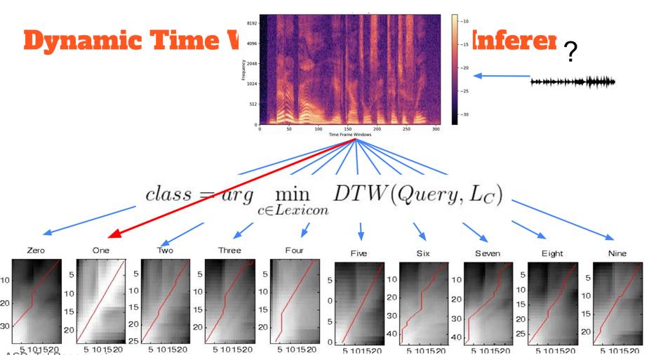

# Assignment 2: Automatic Speech Recognition (ASR) basics

**Course:** Advanced Topics in Audio Processing using Deep Learning 

**Environment:** Python 3.10

## Project Overview

This project implements a basic ASR pipeline, including data loading, feature extraction using Mel Spectrograms, and sequence alignment/classification using **Dynamic Time Warping (DTW)** and **Connectionist Temporal Classification (CTC)**.

You can meantime find the drive link of the theoretical part of the assignment [in here](https://docs.google.com/document/d/19fcfkTumvDoBQVct8EGvNoBGZGCHtH-_ZDBjuqMfEvk/edit?usp=sharing)

## 1. Dataset & Preprocessing

**Data Collection:** Recorded 9 individuals (4 females, 5 males) pronouncing digits 0-9 and a random word ("banana"). Overall collected 11 audio files per speaker (Total: 99 files).

**Resampling:** All audio files are resampled to a consistent frequency of 16 kHz.

**Data Split:** 
- **Class Representative:** 1 speaker (used as the reference to align with)
- **Training Set:** 2 males, 2 females.
- **Evaluation Set:** 2 males, 2 females.

## 2. Feature Extraction

For each audio file, we compute a Mel Spectrogram with the following parameters:
**Window size:** 25ms, **Hop size:** 10ms, **Filter banks (N_mels):** 80.

## 3. Dynamic Time Warping (DTW)
**Goal:** Align training/evaluation samples against the Class Representative's reference signals.
**Classification:** Each recording is classified based on the minimum DTW cost.
**Thresholding:** A similarity threshold is implemented to ensure the random word ("banana") is correctly labeled as a non-digit.
**Optimization:** Applied normalization (AGC) and length-based distance normalization.

## 4. CTC Algorithm (Forward & Force Alignment)
* Implementation of the CTC collapse function .
**Forward Pass:** Calculation of the sequence probability using the forward variable .
**Force Alignment:** Finding the most probable path and aligning the text to the audio signal.

**How to run the CTC demo:** Set `RUN_CTC` to `True` in `main.py`. The demo uses a small synthetic log-probability matrix (no model required) and prints the CTC log-probability, the collapsed best path, and alignment segments.

**CTC Tasks (Parts 4–7):** Run `python ctc_tasks.py` after placing `force_align.pkl` in the repo root. This script computes the `P(aba)` forward probability for the provided `pred` matrix, runs forced alignment (max instead of sum), and saves all required plots to `assets/`:
- `ctc_pred_matrix.png`
- `ctc_aba_alignment.png`
- `ctc_aba_backtrace.png`
- `ctc_force_align_overlay.png`
- `ctc_force_align_backtrace.png`

**How the assignment items map to the code:**
- **CTC collapse (B)** → `ctc.py` → `ctc_collapse()`
- **Forward pass (α)** → `ctc.py` → `ctc_forward_logprob()`
- **Pred matrix + label mapping + P(aba)** → `ctc_tasks.py` → `run_pred_example()`
- **Pred plot with labels (log probs)** → `ctc_tasks.py` → `plot_prob_matrix()`
- **Force alignment (max instead of sum)** → `ctc_tasks.py` → `ctc_viterbi_align()`
- **Aligned path overlay + backtrace plot** → `ctc_tasks.py` → `plot_alignment_overlay()` and `plot_backtrace()`
- **force_align.pkl run** → `ctc_tasks.py` → `run_force_align_pkl()`

## Installation & Usage

1. Clone the repository: `git clone git@github.com:shirashko/Advanced-Topics-in-Audio-Processing-Using-Deep-Learning.git`
2. Install dependencies: `pip install -r requirements.txt`
3. Run the main script: `python main.py`